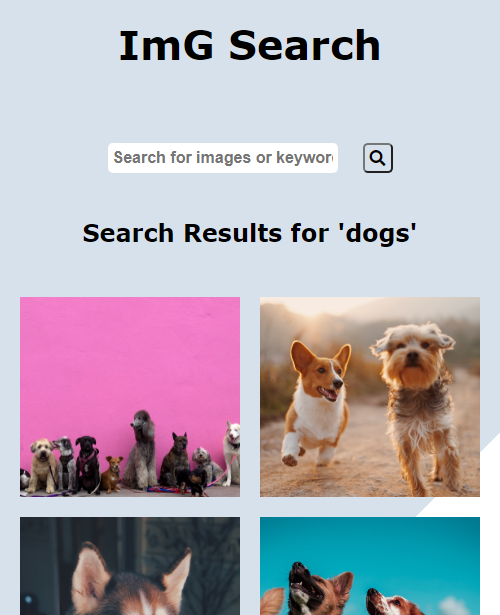

# ImG Search

## Description

An image search application that utilizes the unsplash Api to return images that match user queries.

## Tools

- **HTML**
- **CSS**
- **Javascript**
- **UnsplashAPI**
- **NetlifyFunctions**

## Installation

- ** Clone Repo **
- ** Npm install **
- ** Rename .env.example to .env **
- ** Input client_id you get from [Unsplash](https://unsplash.com/developers) into your .env file **
- ** npm run netlify dev ** to serve in dev environment

## Author

- [**Edori Atiri**](https://github.com/EdoriAtiri)
